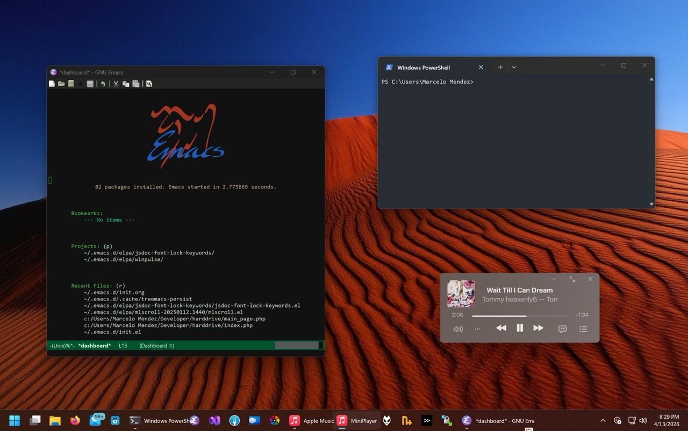

* ~yggdrasil~

[[file:img/desktop.jpeg]]

- editor :: emacs
- shell :: fish
- terminal :: ghostty 

#+HTML: 

installed packages and applications

- [[https://git-fork.com/][fork]]
- [[https://virtualbuddy.app/][virtualbuddy]]
- keka
- [[https://sketch.com][sketch]]
- [[https://rm2000.app][rm2000 tape recorder]]
- nicotine+
- transmit ftp client
- netnewswire
- mona for mastodon
- hackit
- iina
#+HTML: 

* ~soulsilver~

- editor :: emacs
- shell :: ps
- terminal :: windows terminal

#+HTML: 

installed packages and applications

- wino mail
- keyguard
- [[https://git-fork.com/][fork]]
- [[https://github.com/M2Team/Nanazip][nanazip]]
- foobar2000
- nicotine+
- winscp ftp client
- jpegview
- mpc-hc
#+HTML:

* Quick tips:

- Don't symlink entire ~emacs.d~ folder, only symlink files

#+begin_src shell
  stow -t "$HOME" --no-folding emacs
#+end_src

- Don't track ~init.el~ after stowing it

#+begin_src shell
  git update-index --assume-unchanged emacs/.emacs.d/init.el
#+end_src
- Don't native compile elisp (ephemeral setups)

Touch a file titled ~.dir-locals.el~ with the contents of:

#+begin_src emacs-lisp
  ((nil . ((no-native-compile . t))))
#+end_src

- Installing stuff without sudo privileges

**** homebrew

#+begin_src shell
  git clone https://github.com/Homebrew/brew homebrew

  eval "$(homebrew/bin/brew shellenv)"
  brew update --force --quiet
  chmod -R go-w "$(brew --prefix)/share/zsh"
#+end_src

**** Node

https://www.johnpapa.net/node-and-npm-without-sudo/
